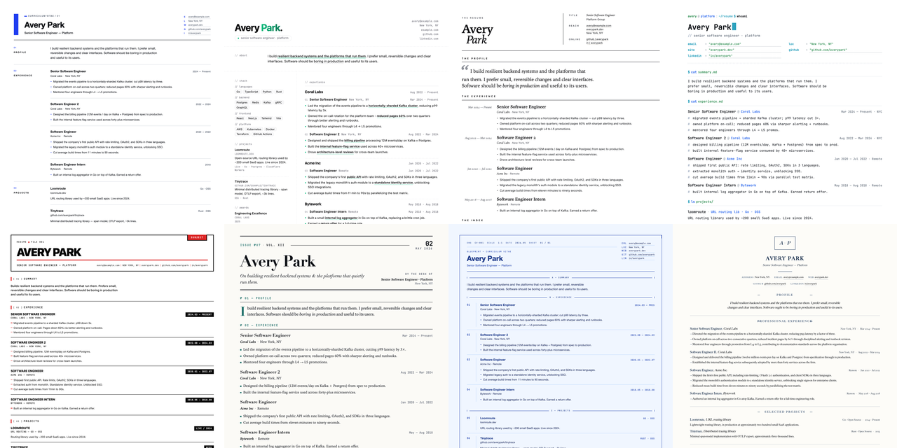

<p align="center">
  <a href="https://resumex.karnstack.com/templates">
    
  </a>
</p>

<h1 align="center">resumex</h1>

<p align="center">
  AI-first resume builder. 100+ templates. Talk to Claude. Ship a PDF.
</p>

<p align="center">
  <a href="https://github.com/karnstack/resumex/blob/main/LICENSE"></a>
  <a href="https://resumex.karnstack.com/templates"></a>
  <a href="https://github.com/anthropics/claude-code"></a>
</p>

## quickstart

```bash
git clone https://github.com/karnstack/resumex && cd resumex
claude        # then say:  /start
```

`/start` installs Node and pnpm via mise, installs deps, and opens the local app at http://localhost:5173. After that, just talk to Claude.

## why people use it

- **100+ templates, ready to fork.** academic, brutalist, dossier, banker, magazine, terminal, architect, editorial. every aesthetic, all in the repo. swap between them in one sentence.
- **Talk, don't click.** *"tighten the bullets"*, *"make a backend-focused variant"*, *"swap to display-noir for the design role"*. Claude does the edit. you read the diff.
- **Yours forever.** every resume is a folder of files on your laptop. no signup, no account, no SaaS. delete your laptop tomorrow and your resume is still in git.
- **Print-native PDF.** `Cmd+P → Save as PDF`. no headless browser, no PDF library. what you see in the browser prints exactly that.

## how it works

1. clone the repo and run `pnpm install`.
2. open Claude Code in the project and run `/start`. it picks a template with you and bootstraps your resume.
3. keep talking. ask for variants, tone changes, layout swaps, anything. when you're happy, `Cmd+P → Save as PDF`.

## templates

Browse all 100+ at [resumex.karnstack.com/templates](https://resumex.karnstack.com/templates). Source for each lives in [`templates/`](./templates).

## files

- [`resumes/<variant>/`](./resumes): your resumes. each variant is a folder with `index.tsx`, `styles.css`, and `meta.ts`. See [docs/CONVENTIONS.md](./docs/CONVENTIONS.md).
- [`templates/<id>/`](./templates): bundled templates. fork one with *"create a new resume from the swiss template"*. See [docs/TEMPLATE_GUIDE.md](./docs/TEMPLATE_GUIDE.md).

## stack

Vite · React 19 · TanStack Router · Tailwind v4 · TypeScript · zod.

## license

MIT.
